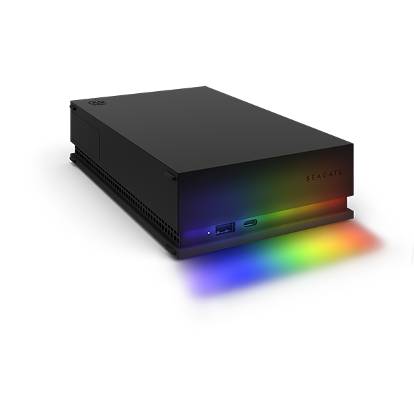

.. _legend35_board:

Legend 3.5" board
#################

Overview
********

The Legend 3.5" board can be found in the Seagate FireCuda Gaming Hub and Gaming
Drive Hub for Xbox devices. A Genesys Logic GL3523-S USB hub is connected to an
ASMedia ASM1153 USB-to-SATA bridge controller and a STM32F070 MCU. The two chips
are connected together using I2C.

The Zephyr port is running on the STM32F070 MCU.

Hardware
********

- STM32F070cb MCU:

  - ARM Cortex-M0+
  - 16KB SRAM
  - 128KB on-chip flash

- External devices connected to the STM32F070cb MCU:

  - ASMedia ASM1153 USB-to-SATA bridge (I2C master on port 1)
  - 12 Everlight B1414 LEDs connected on SPI1 MOSI
  - 1 white LED
  - 64KB external SPI flash connected on SPI2

Supported Features
==================

All the hardware features available on the Legend 3.5" boards are supported by
Zephyr.

+-----------+------------+-------------------------------------+
| Interface | Controller | Driver/Component                    |
+===========+============+=====================================+
| NVIC      | on-chip    | nested vector interrupt controller  |
+-----------+------------+-------------------------------------+
| SYSTICK   | on-chip    | systick                             |
+-----------+------------+-------------------------------------+
| CLOCK     | on-chip    | clock and reset control             |
+-----------+------------+-------------------------------------+
| GPIO      | on-chip    | gpio                                |
+-----------+------------+-------------------------------------+
| I2C       | on-chip    | i2c master/slave controller         |
+-----------+------------+-------------------------------------+
| UART      | on-chip    | serial                              |
+-----------+------------+-------------------------------------+
| SPI flash | on-chip    | spi_nor                             |
+-----------+------------+-------------------------------------+
| LED strip | on-chip    | ws2812                              |
+-----------+------------+-------------------------------------+
| USB       | on-chip    | usb                                 |
+-----------+------------+-------------------------------------+

Connections and IOs
===================
+---------+-----------------+----------------------------+
| Name    | Function        | Usage                      |
+=========+=================+============================+
| PB6     | I2C1            | I2C1 SCL                   |
+---------+-----------------+----------------------------+
| PB7     | I2C1            | I2C1 SDA                   |
+---------+-----------------+----------------------------+
| PA10    | UART            | USART0 RX                  |
+---------+-----------------+----------------------------+
| PA9     | UART            | USART0 TX                  |
+---------+-----------------+----------------------------+
| PB0     | PWM             | Activity LED               |
+---------+-----------------+----------------------------+
| PB12    | SPI2            | SPI2 Enable                |
+---------+-----------------+----------------------------+
| PB13    | SPI2            | SPI2 Clock                 |
+---------+-----------------+----------------------------+
| PB14    | SPI2            | SPI2 MISO                  |
+---------+-----------------+----------------------------+
| PB15    | SPI2            | SPI2 MOSI                  |
+---------+-----------------+----------------------------+
| PA7     | LED strip       | SPI1 MOSI                  |
+---------+-----------------+----------------------------+
| PA12    | USB             | USB DM                     |
+---------+-----------------+----------------------------+
| PA13    | USB             | USB DP                     |
+---------+-----------------+----------------------------+

Programming and Debugging
*************************

Flashing
========

The STM32F070cb MCU can be flashed by connecting an external debug probe to the
SWD port (on-board 4-pin header). In the default OpenOCD configuration, the
ST Link interface is selected. You may need to replace it with the interface of
your debug probe.

Once the debug probe is connected to both the Legend board and your host
computer, then you can simply run the ``west flash`` command to write a firmware
image into flash.

Debugging
=========

Please refer to the `Flashing`_ section and run the ``west debug`` command
instead of ``west flash``.

References
**********

.. target-notes::

.. _STM32F070 reference manual:
   http://www.st.com/resource/en/reference_manual/dm00031936.pdf
